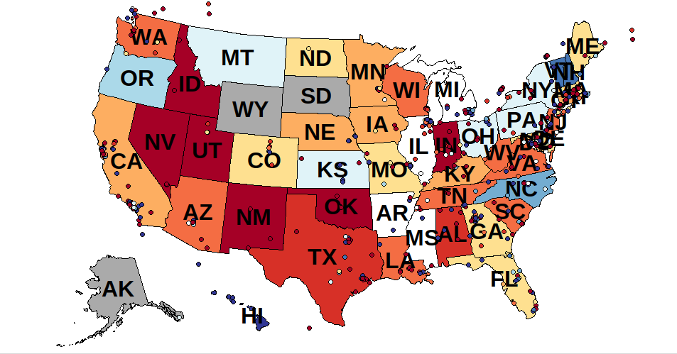
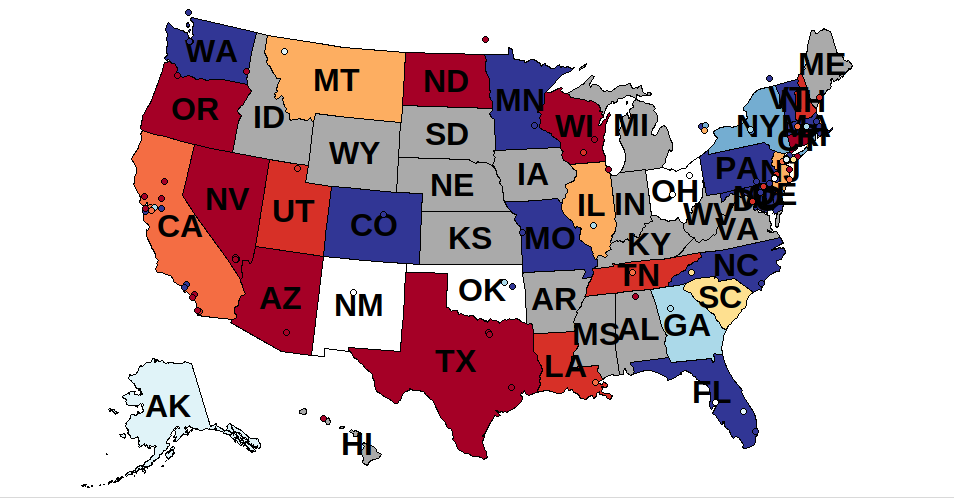

# Twitter Trends

Implementation of the Twitter Trends project for Berkeley's [CS61A](https://inst.eecs.berkeley.edu//~cs61a/fa13/proj/trends/trends.html) ( as part of Composing Programs).

Analyzing sentiment in tweets from the US and visualizing those sentiments.

Example outputs include the sentiments for *sandwich*, where red is positive and blue is negative:

And the sentiments for *europe*:

